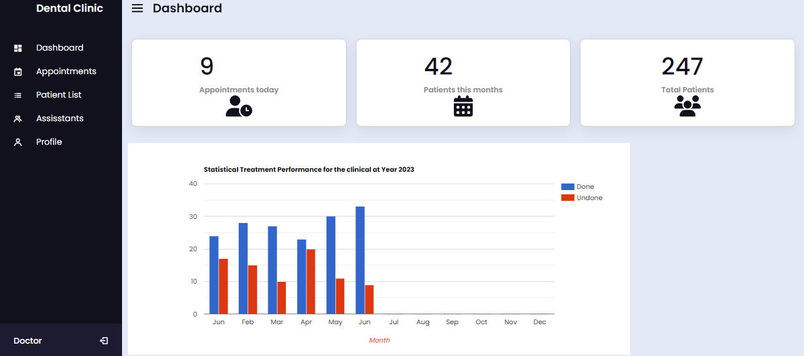
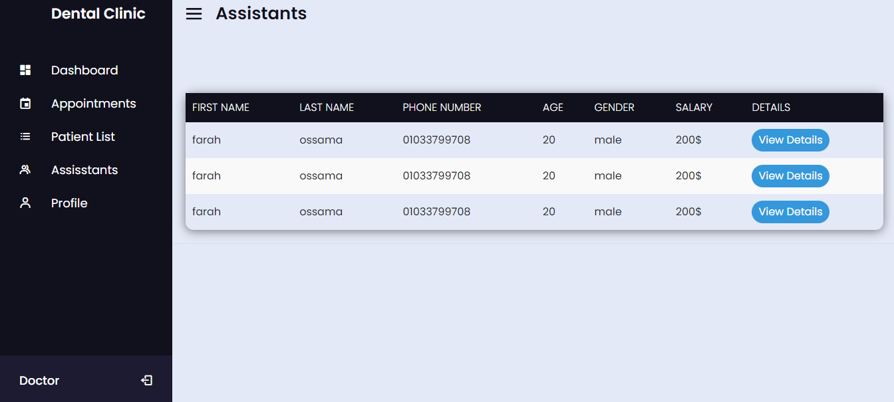
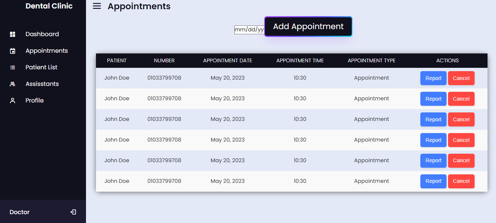
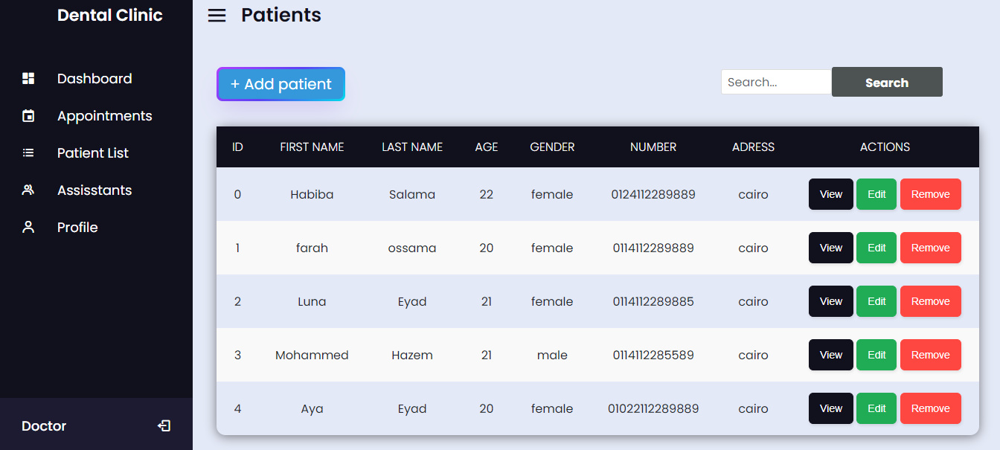
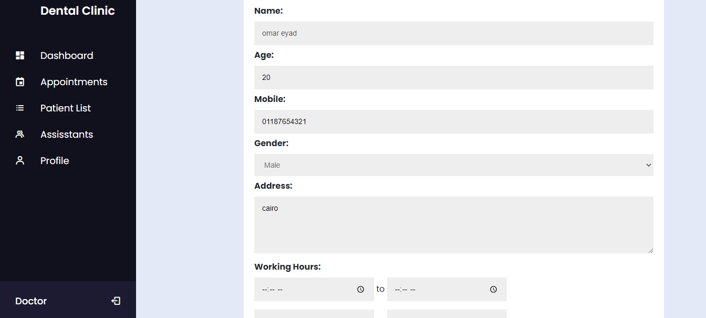

# Dental Clinical System - README

## Table of Contents
1. [Introduction](#introduction)
2. [Team Members](#team-members)
3. [Features](#features)
4. [Screenshots](#screenshots)
5. [How to Run the Project](#how-to-run-the-project)

## Introduction
Welcome to the Dental Clinical System! This system is designed to be used by doctors and nurses in dental clinics to manage patient information and appointments effectively. It allows users to perform various tasks such as adding patients, scheduling appointments, managing prescriptions, and more.

## Team Members
The following team members have contributed to this project:
- Aya Eyad Aly
- Luna Eyad Khaled
- Aya Salah Rekaby
- Farah Osama Sabra
- Mohamed Hazem Yehya
- Habiba Salama Ahmed

## Features
The Dental Clinical System provides the following features:

1. **User Management**
   - The User class represents doctors or assistants.
   - Users can be doctors or assistants.

2. **Patient Management**
   - Users can add patients to the system.
   - View and edit patient details.
   - Delete patient records.

3. **Appointment Management**
   - Users can schedule appointments for patients.
   - Appointments come with a report.
   - Users can add descriptions and required prescriptions for appointments.
   - Edit appointment details.
   - Delete appointment records.
   - Appointments have a fixed length of 30 minutes to avoid conflicts.

4. **Assistant Management**
   - Users can view the list of assistants.

5. **Statistics**
   - The system provides statistics regarding patients and appointments.

6. **Filtering and Searching**
   - Appointments can be filtered by date.
   - Patients can be searched by name or ID.

## Screenshots
Here are some screenshots of the Dental Clinical System:

- Dashboard
  

- Assistant View
  

- Appointment View
  

- Patients View
  

- Profile View
  

## How to Run the Project
To run the Dental Clinical System, follow these steps:

1. Install Django, MySQL, and mysql-connector-python on your system.

2. Run `mydb.py` to create the database. The database is called `honmono_db`.

3. Modify the password in the following files:
   - `settings.py`
   - `login_app\view.py`
   - `mydb.py`

   Search for the password "12345" in these files and replace it with the new password you desire for your database.

4. Once the setup is complete, you can start the Django development server and launch the project.

   Example command to run the server: `python manage.py runserver`

5. Access the Dental Clinical System by visiting `http://localhost:8000` in your web browser.

You are now ready to use the Dental Clinical System! If you encounter any issues or have questions, please refer to the documentation or contact the team members mentioned above.

